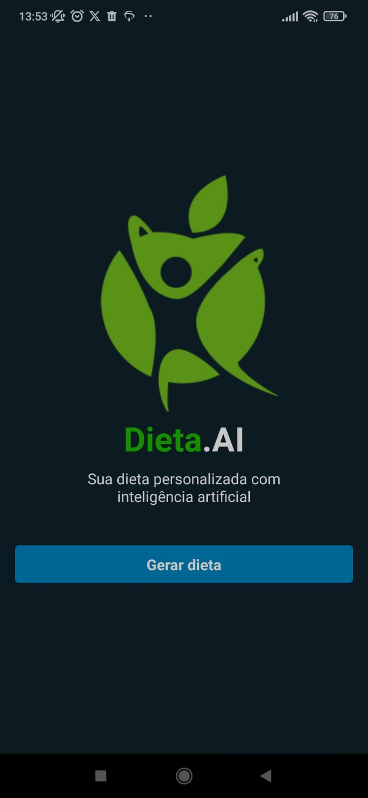
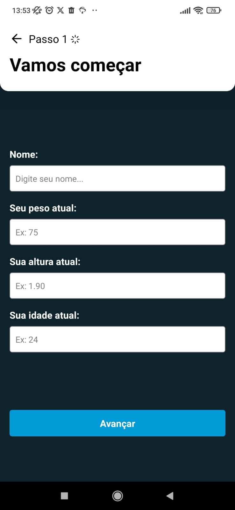
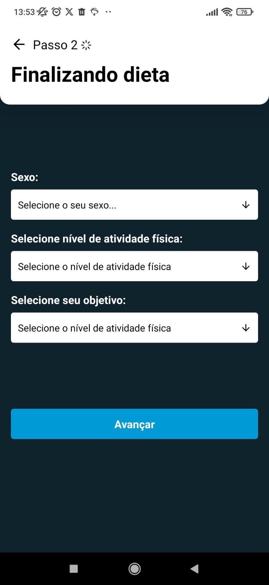
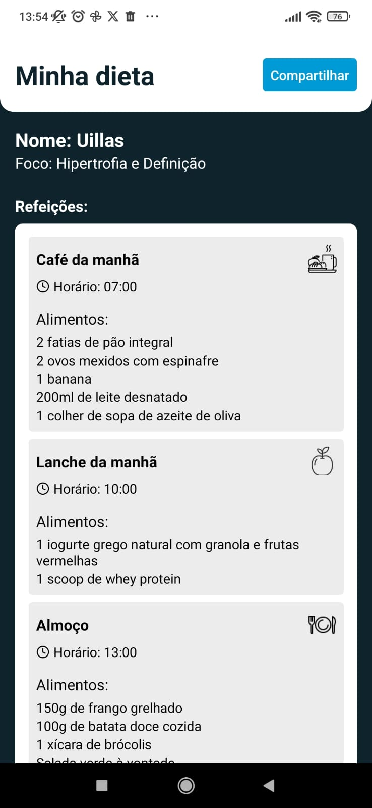

<p align="center">
  
</p>

# 🥗 Dieta.AI

## 📱 Sobre o Projeto

Dieta.AI é um aplicativo mobile inovador que utiliza inteligência artificial para criar planos alimentares personalizados com base nas características individuais do usuário. O sistema considera fatores como altura, peso, idade, sexo e nível de atividade física para gerar uma dieta balanceada e adequada às necessidades específicas de cada pessoa.

## 🎯 Funcionalidades Principais

- ✨ Criação de dieta personalizada usando IA
- 📈 Recomendações baseadas no perfil do usuário
- 🔄 Planos alimentares detalhados

## 📱 Telas do Aplicativo

| Tela Inicial | Coleta de Dados (Passo 1) | Finalização (Passo 2) | Plano Alimentar |
|--------------|----------------------------|-----------------------|------------------|
|  |  |  |  |

## 🚀 Tecnologias Utilizadas

- **Frontend:**
  - React Native
  - TypeScript
  - Expo

- **Backend:**
  - Node.js
  - Fastify
  - Google Generative AI
  - TypeScript

- **IA:**
  - Google Gemini

## 🔧 Instalação

```bash
# Clone o repositório
git clone https://github.com/uillasnr/dieta-ai.git

# Entre no diretório
cd dieta-ai

# Instale as dependências
npm install

# Inicie o projeto
npm start
```


##  Autor

<a href="https://github.com/uillasnr">
  
  <br />
  <sub>
    <strong>Uillas nascimento reis</strong>
  </sub>
</a>

Feito por Uillas  Entre em contato!

[](https://www.linkedin.com/in/uillasnr)
[](wiliasreis@hotmail.com)
[](https://wa.me/5511991654732)


